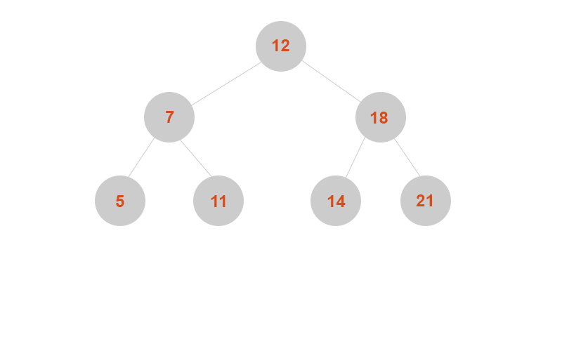
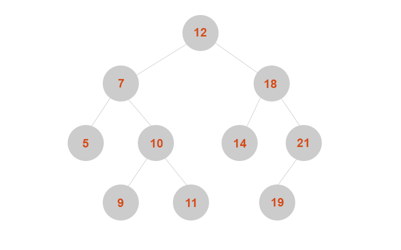
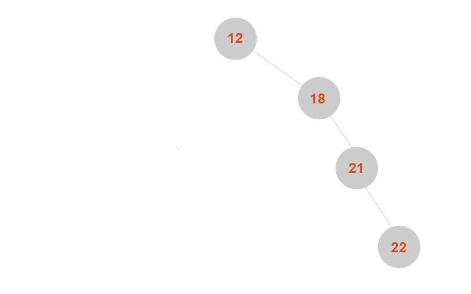

# Binary Search Tree (BST) in JavaScript

This section provides a look at the **Binary Search Tree (BST)** data structure in JavaScript.

A BST is a type of binary tree that organizes data in sorted order that allows for efficient search, insert, and delete operations.

A BST can manage various data types. Imagine a BST that organizes library books based on their ISBN numbers. The tree's structure ensures that books are arranged in a manner that allows for efficine searches, insertins, and deletions.

## Table of Contents

- [Overview](#overview)
- [Properties of a BST](#properties-of-a-BST)
- [Types of BSTs](#types-of-BSTs)
- [Common Operations](#common-operations)
- [Analogy](#analogy)
- [Resources](#resources)

## Overview

A **Binar Search Tree** is a type of binary tree, which means that each node has at most two children.
For any given node: - The left subtree contains nodes with values less than the node's value. - The right subtree contains nodes with values greater than the node's value.

This property allows for efficine operations, particularly with sorted data.

## Use cases

BSTs are ideal for:

- **Efficinet Searching:** Logarithmic time complexity for average-case search operations.
- **Sorted data:** Retrieving data in a sorted order with an in-order traversal.
- **Dynamic Sets of data:** Managing data that changes over time with frequent insertions and deletions.

## Properties of a BST

- **Root Node:** The topmost node in the tree.
- **Left Subtree:** Contains nodes with values less than the parent node's value.
- **Right Subtree:** Contains nodes with values greater than the parent node's value.
- **No Duplicate values:** Typically, BSTs do not allow duplicate values.

### Complexity

- **Time complexity:**
  - Average case: O(log n) for search, insert, and delete.
  - Worst case: O(n) for search, insert and delete (for unbalanced trees).
- **Space complexity:**
  - O(n), where n is the number of nodes.

## Types of BSTs

### Balanced BST

A **BST** is considered **balanced** if the difference in height between the left and right subtrees of
any node is at most 1 (or kept within a reasonable range). This ensures that the tree doesn't become too tall and skewed.

### Unbalanced BST

A **BST** is considered **unbalanced** when one of the subtrees becomes much taller thant the other. This happens with ordered data, where inserting elements in a sorted order (ascending or descending) results in a tree that resembles a linked list rather than a balanced binary tree.

Balancing is crucial because it ensures the tree remains efficient for operations, avoiding of the tree to resemble a linked list.

## Common Operations

Here are the core operations that can be performed on a Binary Search Tree.

- **Insertion:** Add a new node with a given value, preserving the BST property.
- **Search:** Find a value in the BST (if exists).
- **Deletion:** Remove a node with a specific value, re-structuring the tree if needed to maintain the BST property.

## Analogy

You can think of a BST like a dictionary. You don't flip through the pages randomly,
instead you look for words by knowing that earlier words (alphabetically) are in front and later ones are in the back. This helps you find the searched word faster.

## Resources

- [zerotomastery.io](https://zerotomastery.io/)
- [algoexpert.io](https://algoexpert.io/)
- [MDN Web Docs](https://developer.mozilla.org/en-US/)
- [JavaScript.info](https://javascript.info/)
- Data Structures and Algorithms with JavaScript by Michael McMillan.
